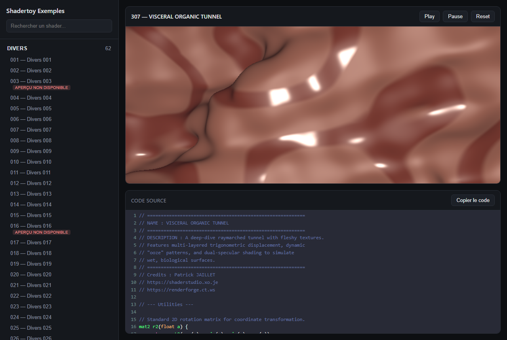

# Shadertoy Exemples

Site web statique permettant de parcourir et visualiser les shaders GLSL du dépôt directement dans le navigateur, avec un viewport de rendu WebGL et un éditeur de code consultable et copiable.



## Fonctionnalités

- Navigation par catégorie (`divers`, `raymarching`, `retro-synthwave`, `retro-gaming`, `space-cosmos`, `tunnel`, `water`) avec recherche en direct.
- Viewport de rendu WebGL en résolution fixe 800×450, avec les uniforms standards Shadertoy (`iResolution`, `iTime`, `iTimeDelta`, `iFrame`, `iMouse`, `iDate`) et les contrôles Play/Pause/Reset.
- Éditeur de code en lecture seule avec coloration syntaxique GLSL et bouton de copie du code source.
- Lien direct partageable vers un shader précis (`#/<numéro>`).
- Détection et signalement des shaders non affichables (dépendant de textures externes absentes du dépôt) : badge dans la liste et message explicite dans le viewport, le code restant toujours consultable.
- Erreurs de compilation GLSL affichées de façon lisible dans l'interface plutôt qu'un écran noir silencieux.
- Export vidéo : enregistrement du rendu image par image (durée et FPS paramétrables), assemblé en fichier `.mp4` téléchargeable directement depuis le navigateur.

378 shaders sont actuellement référencés, dont 19 marqués comme non affichables (dépendance à des textures externes non fournies dans le dépôt).

## Site publié

Le site est déployé automatiquement sur GitHub Pages à chaque mise à jour de la branche `main` :

**https://patrickjaillet.github.io/Shadertoy-Exemples**

## Ajouter un nouveau shader

1. Déposer le fichier `.glsl` dans le dossier de catégorie approprié (`divers`, `raymarching`, `retro-synthwave`, `retro-gaming`, `space-cosmos`, `tunnel`, `water`), avec le contenu du pass `Image` uniquement (les shaders multi-passes ne sont pas supportés).
2. Nommer le fichier selon le format `NNN-simple.glsl`, où `NNN` est le prochain numéro disponible dans la séquence continue globale du dépôt.
3. Régénérer l'index des données :

   ```bash
   node scripts/build-index.js
   ```

4. Committer les fichiers modifiés, y compris le contenu régénéré de `data/`.

Le déploiement GitHub Pages régénère de toute façon `data/` automatiquement à chaque push sur `main` ; l'étape 3 sert surtout à vérifier localement que le shader est bien pris en compte avant de pousser.

## Développement local

Aucune dépendance à installer pour le site lui-même (HTML/CSS/JS vanilla, bibliothèques chargées via CDN). Pour tester en local :

```bash
npx serve .
```

Puis ouvrir l'URL affichée dans un navigateur.

## Pile technique

- HTML/CSS/JS vanilla, WebGL2 pour le rendu des shaders.
- [CodeMirror 5](https://codemirror.net/5/) pour la coloration syntaxique GLSL de l'éditeur (chargé via cdnjs).
- [ffmpeg.wasm](https://ffmpegwasm.netlify.app/) (binaires servis localement depuis `assets/vendor/ffmpeg/`) pour l'export vidéo `.mp4`.
- Node.js pour le script de build (`scripts/build-index.js`), sans dépendance npm.
- GitHub Actions pour le déploiement automatique sur GitHub Pages.

## Documentation du projet

Le détail des étapes de développement, des choix techniques et des limitations connues est documenté dans [roadmap.md](roadmap.md).

## Licence et copyright

**Shadertoy Exemples**
Copyright © 2026 Patrick JAILLET — Tous droits réservés
E-mail : sandefjord.development@proton.me
Site web : https://patrickjaillet.github.io/Shadertoy-Exemples
